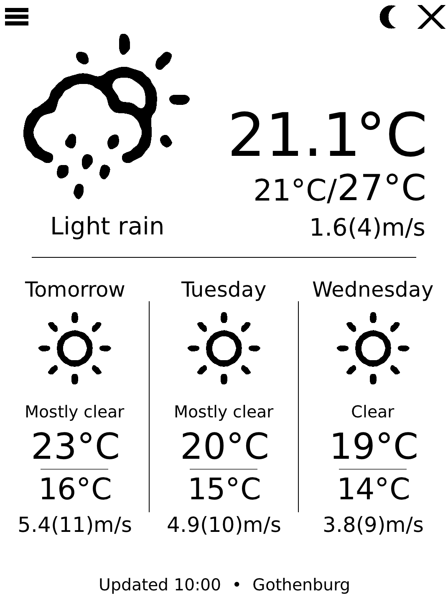
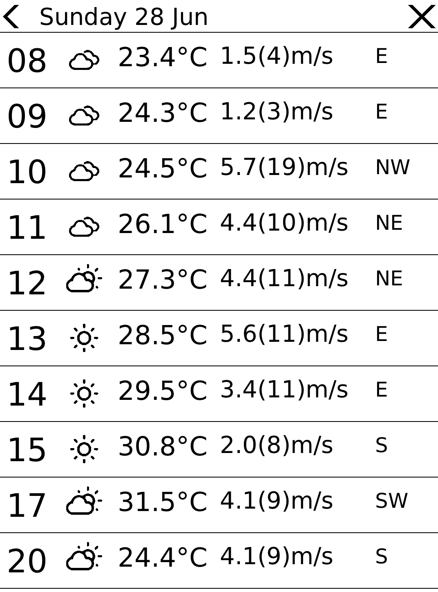
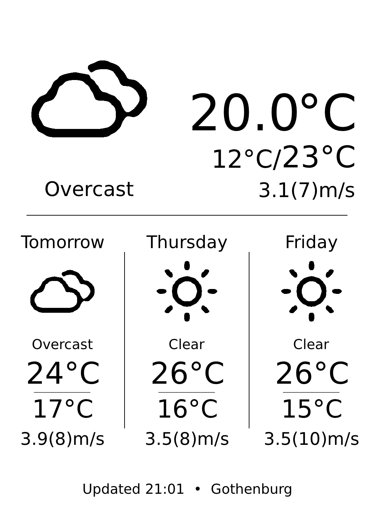

# Kobo Weather

NOTE1: Entering sleep mode takes about 5 seconds. Pushing the powerbutton in this window will make the sleep-process restart and take another 5 seconds, and the app will hence appear to have frozen. Wait at least 5 seconds before trying to wake the app up by the powerbutton.

A small, native weather app for Kobo e-readers(Clara BW/Colour and Libra colour). It shows current conditions,
a three-day forecast, and an hour-by-hour breakdown — rendered for e-ink with
FBInk and launched straight from the home screen via NickelMenu.

The app geolocates from your IP (or a fixed location you configure), fetches
from **Open-Meteo**, and runs an always-on kiosk loop that puts the device in deep sleep (CPU & WIFI OFF),
only waking up by a timer periodically to fetch fresh weather data and update the screen.

## Screenshots

| Home | Hourly | Kiosk (sleep) |
| --- | --- | --- |
|  |  |  |

## Installing


With nickelmenu installed, copy the binary and its assets to the /nm-folder so the layout is:

```
/mnt/onboard/.adds/nm/kobo_weather/
├── kobo_weather          # the binary
└── fonts/
    ├── DejaVuSans.ttf
    └── DejaVuSans-Bold.ttf
```

The binary `chdir()`s to its own directory at startup, so it can live anywhere
under `/mnt/onboard`; `fonts/` and the optional `weather.conf` are resolved
relative to it. Without a config file the app detects your location from IP and
defaults sensibly — settings are managed in-app and persisted automatically.

## Launching from NickelMenu

Install [NickelMenu], then create `/mnt/onboard/.adds/nm/kobo_weather`:

```
menu_item :main :Weather :cmd_spawn :quiet:/mnt/onboard/.adds/kobo_weather/kobo_weather
```

Add `--debug` to a second entry to write verbose WiFi/refresh diagnostics to
`run.log` next to the binary. See [`doc/nickelmenu-example.txt`](doc/nickelmenu-example.txt)
for details.

## Building

Cross-compiled for Kobo (ARM) with [koxtoolchain]. You need the toolchain plus
two libraries — **mbedTLS** (HTTPS) and **FBInk** (e-ink drawing).

```sh
# 1. Build FBInk once (clones it under libs/ and installs to $FBINK_PREFIX):
make fbink

# 2. Build mbedTLS for the same toolchain and point MBEDTLS_PREFIX at it.
#    Then build the app:
make
```

Override the toolchain and library locations as needed:

```sh
make CROSS=arm-kobov4-linux-gnueabihf \
     MBEDTLS_PREFIX=$HOME/install/mbedtls-kobo \
     FBINK_PREFIX=$HOME/install/fbink-kobo
```

The result is a single stripped binary, `kobo_weather`.

## Credits

Bundled third-party code: [stb_image] (public domain) and [cJSON] (MIT).
Built against [FBInk] and [mbedTLS], which are fetched/linked at build time.

[koxtoolchain]: https://github.com/koreader/koxtoolchain
[NickelMenu]: https://github.com/pgaskin/NickelMenu
[KoboRoot]: https://www.mobileread.com/forums/showthread.php?t=254214
[FBInk]: https://github.com/NiLuJe/FBInk
[mbedTLS]: https://github.com/Mbed-TLS/mbedtls
[stb_image]: https://github.com/nothings/stb
[cJSON]: https://github.com/DaveGamble/cJSON
